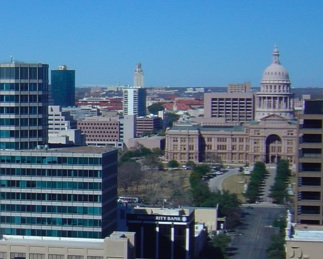
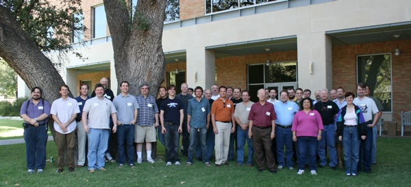

#format rst

Texas Regional Python Unconference 2008
=======================================

::

   #class right
   ## Snazzy graphics here...

* **October 4-5, 2008**

* University of Texas

* Austin, TX

-------------------------

This is the Second Annual Texas Regional Unconference for Python.  Like last year, this unconference is intended to be a FREE event for Pythoneers from all over the Texas region to gather and share experiences and developments.  Again, the topics to be presented are purely up to the participants.

Please add yourself to the list of presenters and attendees so we'll know you're coming.  As is the tradition for `unconferences <http://en.wikipedia.org/wiki/Unconference>`_, this is a completely self-organizing meeting. Last year there were two main tracks of talks: Python in Scientific Computing, and Python in Web Frameworks.  We welcome any other presentations as well.

You may edit any of these pages by logging in (or clicking login and then following the appropriate link to register yourself).

-------------------------

* [:TXUncon2008Schedule:Schedule]

* [:TXUncon2008Attendees:Attendees]

* [:TXUncon2008Location:Location]

**The 2008 Attendees!**

Many thanks to the University of Texas for hosting the event (esp. Dave Campbell, Brad Knowles and Robert Myers) and providing such a nice venue.

Also thanks to `Zenoss <http://www.zenoss.org>`_ for sponsoring the lunch on Saturday.

-------------------------

`Last year's meeting <http://pycamp.python.org/Texas/HomePage>`_ was a big success.  We look forward to this year's gathering in beautiful `Austin, Texas <http://en.wikipedia.org/wiki/Austin,_tx>`_.

